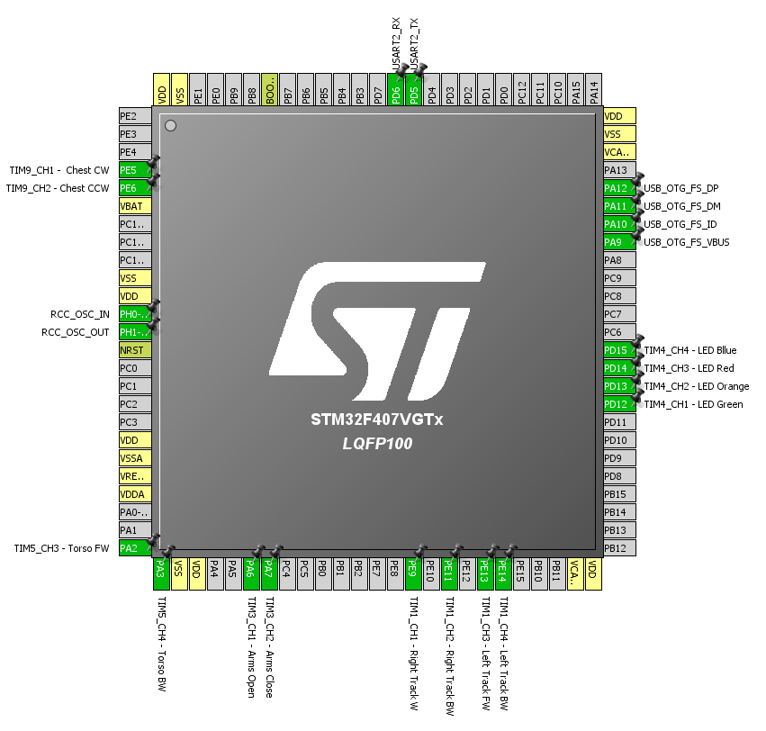

# HomeRobot

STM32F4 Discovery based Robot Controller

The project file can be opened in Visual Studio with VisualGDB.
It uses the HAL library and has a STMCube PinOut reference file.

A ESP8266 wifi module is used with JeeLabs esp-link firmware.
https://github.com/jeelabs/esp-link

Main components
- USB VCP-CDC
- PMW control via Wifi
